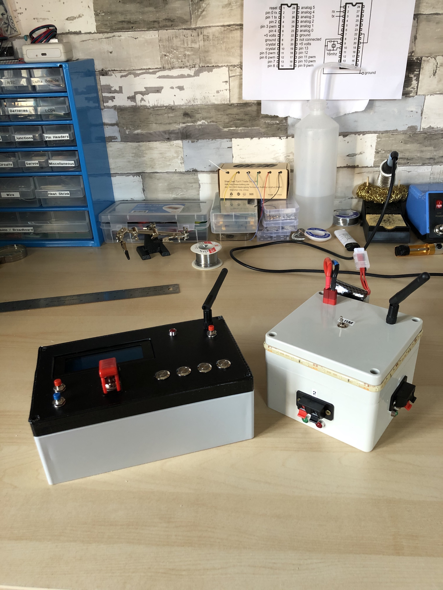

# Fireworks Wireless Firing System

I built this device to wirelessly ignite fireworks for New Year's Eve 2020. There are two different modules for this project: a detonator, and a terminal box. In a few words, the way these modules work is that a signal is transmitted from the detonator to the terminal box to turn on one or several of its outputs. Since an electronic fuse is connected to the output, it will ignite the firework that it is linked to when current runs through it. Both of these modules are powered by 12V 3S LiPo batteries. The communication between the two modules is established with a set of integer codes that are explained in the Communication Protocol section of this README.

## Detonator

The detonator is the main control that the user operates. It features the following components:
- Arduino Nano
- 20x4 LCD screen
- Navigation Button
- Select Button
- 4 Trigger Buttons
- Safety Switch
- NRF24L01 (to communicate with the terminal box)

The code for the Detonator can be found in this repository at "/CODE/FINAL_DET/FINAL_DET.ino".

In the detonator logic, there are two modes that can be accessed: Fire Mode, and Test Connection.

### Fire Mode
	
This mode automatically runs through the safety check of the system before granting the launch commands. It first sends a request to the box to ensure that it is armed. If it is not armed, a message will be printed to the LCD screen asking the user to arm the box. If it is armed, it will then test the lines to ensure that at least one of the outputs is linked to an electronic fuse. Finally, once the box is armed and the lines have been tested, the user can remove the safety and begin launching fireworks.

### Test Connection

This mode tests the connection between both modules. To do that, the detonator instantiates an array of 8 elements. Each element is assigned a random value between 0 and 255. Then this array is sent to the box. The box processes this array, and then sends back the array that it read. Once the detonator receives this processed array, it compares it with the original array to make sure that they are identical. If they are not, that means that the connection was not good enough for the array to be sent properly. This is done 20 times, and a percentage is derived to quantify the quality of the signal.

## Terminal Box

The terminal box is the "slave" that receives commands and requests from the detonator. It features the following components:
- Arduino Nano
- Armed Switch
- LEDs (to show when the system is armed and if fuses are correctly connected to the ouputs)
- LED Warning Strip
- NRF24L01 (to communicate with the detonator)

The code for the Terminal Box can be found in this repository at "/CODE/FINAL_BOX/FINAL_BOX.ino".

## Circuit Schematic

Please note that the wiring of the fuses at the top of the circuit has been inspired by the following post: https://www.electro-tech-online.com/threads/electronic-firing-system-for-fireworks.21046/post-134180

## Communication Protocol

| Detonator     | Box           | Meaning                                            |
| :-----------: |:-------------:| ---------------------------------------------------|
| `4`           |               | `Request to box if box is armed?`                  |
|               | `40`          | `Reponse to det: box not armed`                    |
|               | `41`          | `Reponse to det: box armed`                        |
| 1             |               | Request to box if fuse 1 is connected?             |
|               | 10            | Reponse to det: fuse 1 disconnected                |
|               | 11            | Reponse to det: fuse 1 connected                   |
| `2`           |               | `Request to box if fuse 2 is connected?`           |
|               | `20`          | `Reponse to det: fuse 2 disconnected`              |
|               | `21`          | `Reponse to det: fuse 2 connected`                 |
| 3             |               | Request to box if fuse 3 is connected?             |
|               | 30            | Reponse to det: fuse 3 disconnected                |
|               | 31            | Reponse to det: fuse 3 connected                   |
| `100`         |               | `Command to box to fire fuse 1`                    |
|               | `1001`        | `Confirmation to det: fuse 1 fired`                |
| 200           |               | Command to box to fire fuse 2                      |
|               | 2001          | Confirmation to det: fuse 2 fired                  |
| `300`         |               | `Command to box to fire fuse 3`                    |
|               | `3001`        | `Confirmation to det: fuse 3 fired`                |
| 400           |               | Command to box to fire all fuses                   |
|               | 4001          | Confirmation to det: all fuses fired               |
| `5`           |               | `Command to box to enable fire mode`               |
|               | `51`          | `Confirmation to det: fire mode enabled`           |
| 0             |               | Command to box to reinitialize box (exit fire mode)|
|               | 1000          | Confirmation to det: box reinitialized             |

