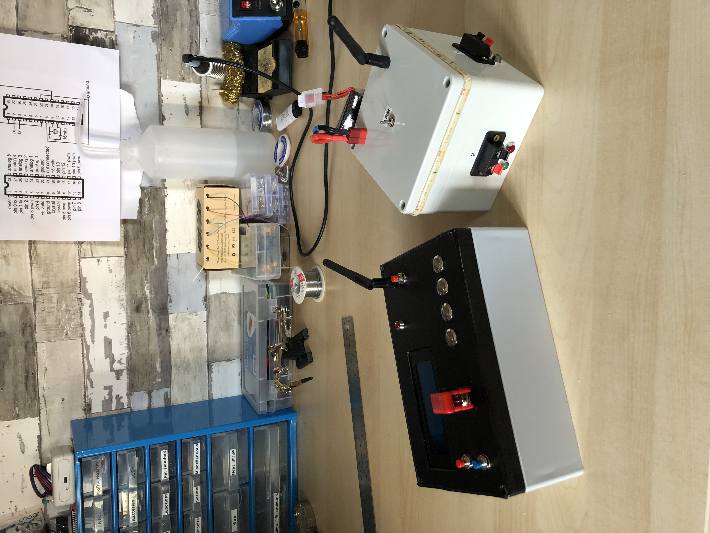

# Fireworks Wireless Firing System

I built this device to wirelessly ignite fireworks for New Year's Eve 2020. There are two different modules for this project: a detonator, and a terminal box. In a few words, the way these modules work is that a signal is transmitted from the detonator to the terminal box to turn on one of its outputs. Since an electronic fuse is connected to the output, it will ignite the firework that it is linked to when current runs through it.

## Detonator

The detonator is the main control that the user operates. It features the following components:
- Arduino Nano
- 20x4 LCD screen
- Navigation Button
- Select Button
- 4 Trigger Buttons
- Safety Switch
- NRF24L01 (to communicate with the terminal box)

## Terminal Box

The terminal box is the "slave" that receives commands and requests from the detonator. It features the following components:
	- Arduino Nano
	- Armed Switch
	- LEDs (to show when the system is armed and if fuses are correctly connected to the ouputs)
	- NRF24L01 (to communicate with the detonator)